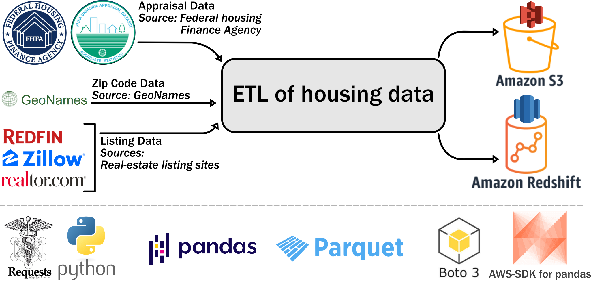

# ETL pipeline for US Housing Price Data Warehouse (AWS S3 & Redshift)

## Project goals & data source 

This pipeline generates a Data Warehouse to perform analytics on US housing. The warehouse is designed to perform analytics based on zip codes. Data for the warehouse comes from five different sources:
1. FHFA appraisal data ([UAD Dataset](https://www.fhfa.gov/DataTools/Pages/UAD-Dashboards.aspx)).
2. [Realtor](https://www.realtor.com/research/data/) research data.
3. [Redfin](https://www.redfin.com/news/data-center/) research data.
4. [Zillow](https://www.zillow.com/research/data/) housing index.
5. Zip code data from [GeoNames](http://download.geonames.org/export/zip/).

## Steps
* Step 1: Prepare appraisal data for zip code-based query (extract data from different sources, transform and join/merge).
* Step 2: Extract and transform realtor, redfin, zillow & zip code data.
* Step 3: Merge/ join transformed FHFA appraisal data, realtor data, redfin data and zillow data to prepare master house price dataset.
* Step 4: Prepare zip code dimension table.
* Step 4: Load tables to AWS S3 bucket.
* Step 5: Load tables to AWS redshift database.

Database is primarily designed to perform queries(and join) on the "zip" column of respective tables.

## Tools/resources used in the project:
* [Python](https://www.python.org/)
* [Requests](https://requests.readthedocs.io/en/latest/)
* [Pandas](https://pandas.pydata.org/)
* [Parquet](https://parquet.apache.org/)
* [Boto3](https://boto3.amazonaws.com/v1/documentation/api/latest/index.html)
* [AWS-SDK for pandas](https://github.com/aws/aws-sdk-pandas) (previously known as awswrangler)

## Schematic outline of the ETL process:

